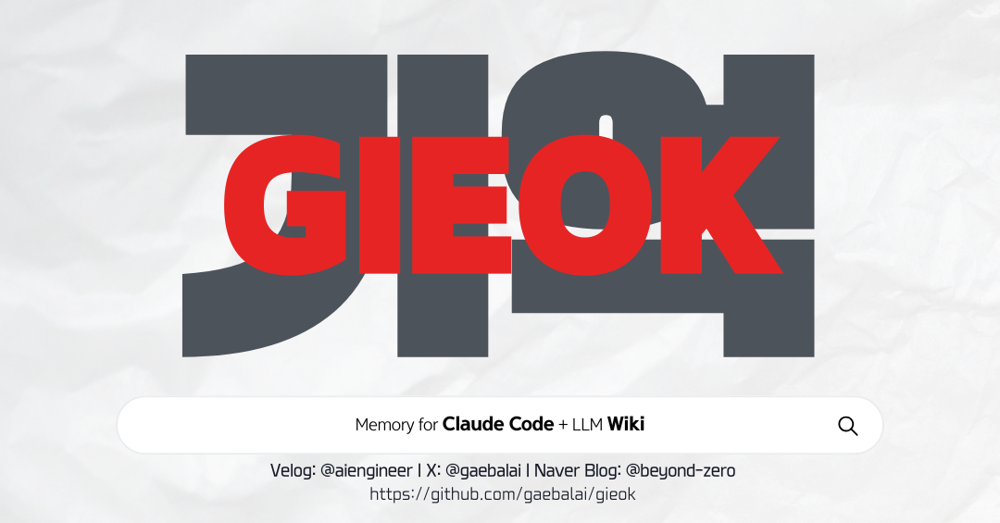

<p align="center">
  
</p>

# GIEOK
### Memory for Claude Code

<sub>*GIEOK(기억)은 한국어로 "memory"를 뜻합니다*</sub>

Claude Code는 세션이 끝나면 과거의 지식을 잊어버립니다.
gieok은 **대화를 자동으로 Wiki에 축적**하고 **다음 세션에서 이를 기억**합니다.

같은 설명을 반복할 필요가 없습니다. 매번 사용할 때마다 성장하는 "세컨드 브레인" — 당신의 Claude를 위해.

<br>

## 주요 기능

Claude Code 세션을 자동으로 기록하고, Obsidian Vault 위에 구조화된 지식 베이스를 구축합니다. Andrej Karpathy의 LLM Wiki 패턴과 자동 로깅 및 여러 머신 간 Git 동기화를 결합했습니다.

```
🗣️  평소처럼 Claude Code와 대화합니다
         ↓  （모든 것이 자동으로 기록됩니다 — 아무것도 할 필요 없습니다）
📝  세션 로그가 로컬에 저장됩니다
         ↓  （스케줄된 작업이 AI에게 로그를 읽고 지식을 추출하게 합니다）
📚  Wiki가 매 세션마다 성장합니다 — 개념, 결정, 패턴
         ↓  （Git으로 동기화）
☁️  GitHub이 Wiki를 백업하고 여러 머신 간에 공유합니다
```

1. **자동 캡처 (L0)**: Claude Code Hook 이벤트(`UserPromptSubmit` / `Stop` / `PostToolUse` / `SessionEnd`)를 포착하여 `session-logs/`에 Markdown으로 기록
2. **구조화 (L1)**: 예약 실행(macOS LaunchAgent / Linux cron)을 통해 LLM이 미처리 로그를 읽고 `wiki/`에 개념 페이지, 프로젝트 페이지, 설계 결정을 작성. 세션 인사이트는 `wiki/analyses/`에도 저장
3. **무결성 검사 (L2)**: 월간 Wiki 상태 점검으로 `wiki/lint-report.md`를 생성. 비밀 정보 유출 자동 탐지 포함
4. **동기화 (L3)**: Vault 자체가 Git 리포지토리. `SessionStart`에서 `git pull`, `SessionEnd`에서 `git commit && git push`를 실행하여 GitHub Private 리포지토리를 통해 머신 간 동기화
5. **Wiki 컨텍스트 주입**: `SessionStart` 시 `wiki/index.md`를 시스템 프롬프트에 주입하여 Claude가 과거 지식을 활용할 수 있도록 지원
6. **qmd 전문 검색**: MCP를 통해 BM25 + 시맨틱 검색으로 Wiki 검색
7. **외부 소스 Ingest (PDF / URL)**: `gieok_ingest_pdf` / `gieok_ingest_url` MCP 도구로 로컬 PDF나 웹 아티클을 한 번의 대화로 Vault에 축적. 긴 PDF는 백그라운드 요약(Option B detached 모드)으로 Claude Desktop 60초 타임아웃 회피
8. **Wiki Ingest 스킬**: `/wiki-ingest-all` 및 `/wiki-ingest` 슬래시 커맨드로 기존 프로젝트 지식을 Wiki에 가져오기
9. **비밀 정보 격리**: `session-logs/`는 머신별 로컬 유지(`.gitignore`). `wiki/` / `raw-sources/` / `templates/` / `CLAUDE.md`만 Git으로 관리

<br>

## 주의사항

> [!CAUTION]
> gieok 의 **본체 가치**(자동 세션 캡처 L0 + Wiki 컨텍스트 주입 + 자동 ingest 파이프라인)는 현재 **Claude Code (Max 플랜)** 가 필요합니다. Hook 시스템과 SessionStart 컨텍스트 주입은 Claude Code 전용 메커니즘입니다.
>
> v0.6 부터 **Codex CLI / OpenCode / Gemini CLI 에서도 skills (슬래시 커맨드) 만은 사용 가능**합니다 (`scripts/setup-multi-agent.sh`). 단, 자동 캡처는 동작하지 않으므로 다른 에이전트는 **이미 Claude Code 로 축적된 Vault 의 후속 조작 (검색 / ingest / lint)** 용으로 활용하는 것이 현실적입니다. 자세한 매트릭스는 아래 [멀티 에이전트 지원](#-멀티-에이전트-지원-v06-신규) 섹션을 참조.
>
> Ingest/Lint 파이프라인(L1/L2)은 `claude -p` 호출을 교체하면 다른 LLM API 와 함께 사용할 수 있습니다 -- 이는 향후 개선으로 계획되어 있습니다.

> [!IMPORTANT]
> 이 소프트웨어는 어떠한 종류의 보증도 없이 **"있는 그대로"** 제공됩니다. 저자는 이 도구의 사용으로 인해 발생하는 데이터 손실, 보안 사고 또는 손해에 대해 **어떠한 책임도 지지 않습니다**. 사용에 따른 위험은 본인이 부담합니다. 전체 약관은 [LICENSE](LICENSE)를 참조하세요.

<br>

## 사전 요구 사항

| | 버전 / 요구 사항 |
|---|---|
| macOS | 13+ 권장 |
| Node.js | 18+ (Hook 스크립트는 `.mjs` ES Module, 외부 의존성 없음) |
| Bash | 3.2+ (macOS 기본) |
| Git | 2.x+. `git pull --rebase` / `git push` 지원 필수 |
| GitHub CLI | 선택 사항 (`gh`로 Private 리포 생성 간소화) |
| Claude Code | **Max 플랜** 필수 (`claude` CLI와 `~/.claude/settings.json`의 Hook 시스템 사용) |
| Codex CLI | 선택 (멀티 에이전트 사용 시. `~/.codex/skills/` 인식) |
| OpenCode | 선택 (멀티 에이전트 사용 시. `~/.config/opencode/skills/` 인식) |
| Gemini CLI | 선택 (멀티 에이전트 사용 시. `~/.gemini/skills/` 인식) |
| Obsidian | 임의 폴더에 Vault 하나 생성 (iCloud Drive 불필요) |
| jq | 1.6+ (`install-hooks.sh --apply`에서 사용) |
| 환경 변수 | `OBSIDIAN_VAULT`가 Vault 루트를 가리키도록 설정 |

<br>

## 빠른 시작

> [!WARNING]
> **설치 전에 이해하세요:** gieok은 **모든 Claude Code 세션 I/O**에 hook됩니다. 이는 다음을 의미합니다:
> - 세션 로그에는 프롬프트와 도구 출력의 **API 키, 토큰 또는 개인 정보**가 포함될 수 있습니다. 마스킹은 주요 패턴을 커버하지만 완전하지는 않습니다 -- [SECURITY.md](SECURITY.md)를 참조하세요
> - `.gitignore`가 잘못 설정되면 세션 로그가 **실수로 GitHub에 푸시**될 수 있습니다
> - 자동 Ingest 파이프라인은 Wiki 추출을 위해 `claude -p`를 통해 세션 로그 내용을 Claude에 전송합니다
>
> 전체 운영을 활성화하기 전에 `GIEOK_DRY_RUN=1`로 파이프라인을 먼저 확인하는 것을 권장합니다.

### ⚡ 원라이너 설치 (가장 빠름)

```bash
# npm (npx) — Node 18+ 있으면 이 한 줄로 충분 (내부에서 install.sh를 그대로 호출)
npx gieok

# 또는 curl
curl -fsSL https://raw.githubusercontent.com/gaebalai/gieok/main/install.sh | bash
```

저장소를 `~/.local/share/gieok/repo`에 clone하고, Vault(`~/gieok/main-gieok`)를 초기화하고, Hook · LaunchAgent · 스킬 · qmd 검색까지 순서대로 설치합니다. `npx gieok` 과 `curl | bash`는 동일한 `install.sh`를 실행하며 플래그도 그대로 전달됩니다.

```bash
# 완전 비대화형 (기본값으로 모두 설치)
npx gieok --yes
# = curl -fsSL https://raw.githubusercontent.com/gaebalai/gieok/main/install.sh | bash -s -- --yes

# 코어만 (스케줄 · qmd · skills 제외)
npx gieok --minimal

# Vault 경로 지정
npx gieok --vault ~/my-vault

# 업데이트 (이미 설치된 경우 다시 실행하면 clone 대신 pull)
npx gieok

# 제거 (LaunchAgent / hook 항목 / 스킬 심볼릭 링크 되돌림)
bash ~/.local/share/gieok/repo/install.sh --uninstall
```

설치 후 Claude Code를 재시작하면 Hook이 적용됩니다. 옵션 전체는 `npx gieok --help`로 확인할 수 있습니다.

### 🖥️ Claude Desktop MCP 연결 (선택)

Claude Desktop에서 Vault를 직접 읽고 쓰려면 `.mcpb` 번들을 드래그 앤 드롭하세요.

```bash
bash scripts/build-mcpb.sh          # gieok-wiki-0.6.0.mcpb 생성
# → Claude Desktop 으로 drag & drop → Vault 디렉터리 지정 → ⌘Q 로 완전 재시작
```

또는 Claude Code / CLI 클라이언트에는 직접 등록:

```bash
bash scripts/install-mcp-client.sh   # ~/.claude.json에 gieok-wiki 항목 자동 주입
```

### 📦 Claude Code 플러그인 마켓플레이스 (v0.6 신규)

Claude Code 사용자는 플러그인 마켓플레이스 명령으로 한 번에 설치 가능:

```bash
claude marketplace add gaebalai/gieok
claude plugin install gieok@gaebalai-marketplace
```

상세한 post-install 절차(Vault 초기화 · Hook 주입 · LaunchAgent · 트러블슈팅)는 [docs/install-guide-plugin.md](docs/install-guide-plugin.md) 참조.

### 🤖 멀티 에이전트 지원 (v0.6 신규)

Codex CLI / OpenCode / Gemini CLI 에도 같은 skills 세트를 배포할 수 있습니다 (symlink, 멱등):

```bash
bash scripts/setup-multi-agent.sh              # 모든 에이전트
bash scripts/setup-multi-agent.sh --agent=codex # 특정 에이전트만 (codex / opencode / gemini)
bash scripts/setup-multi-agent.sh --dry-run    # 확인만
bash scripts/setup-multi-agent.sh --uninstall  # 심볼릭 링크 제거
```

**배포 대상 경로** (각 에이전트의 공식 skills 인식 경로):

| 에이전트 | symlink 위치 | 검증 |
|---|---|---|
| Codex CLI | `~/.codex/skills/gieok` | `ls ~/.codex/skills/gieok/` |
| OpenCode | `~/.config/opencode/skills/gieok` | `ls ~/.config/opencode/skills/gieok/` |
| Gemini CLI | `~/.gemini/skills/gieok` | `ls ~/.gemini/skills/gieok/` |

**기능 가용성 매트릭스** — 다른 에이전트에서는 **skills 슬래시 커맨드만 동작**합니다. 자동 세션 캡처 / Wiki 컨텍스트 주입 / MCP 자동 등록은 Claude Code 전용입니다:

| 기능 | Claude Code | Codex | Gemini | OpenCode |
|---|:-:|:-:|:-:|:-:|
| Skills (`/wiki-ingest`, `/wiki-ingest-all`, `/setup-guide`) | ✅ | ✅ | ✅ | ✅ |
| Hook 자동 세션 캡처 (L0) | ✅ | ❌ | ❌ | ❌ |
| Wiki 컨텍스트 자동 주입 (SessionStart) | ✅ | ❌ | ❌ | ❌ |
| MCP `gieok-wiki` 서버 (8 tools) | ✅ | ❌ (MCP 미지원) | ⚠️ 별도 등록 | ⚠️ 별도 등록 |
| 자동 ingest cron (LaunchAgent) | ✅ | △ source 가 Claude session-logs 에 의존 | △ | △ |

> [!NOTE]
> `/setup-guide` 는 **Claude Code 셋업 안내** 가 주 내용이므로 다른 에이전트에서 호출해도 의미가 없습니다. 다른 에이전트에서는 **`/wiki-ingest`, `/wiki-ingest-all`** 만 사용하는 것을 권장합니다 (이미 Claude Code 로 축적된 Vault 에 대한 후속 조작 용도).

### 🚀 인터랙티브 설정

> [!NOTE]
> Claude Code에서 다음을 입력하면 인터랙티브 가이드 설정이 시작됩니다. 각 단계의 목적을 설명하고 환경에 맞게 조정합니다.

```
Please read skills/setup-guide/SKILL.md and guide me through the GIEOK installation.
```

### 🛠️ 수동 설정

> [!NOTE]
> 각 단계를 직접 이해하고 싶은 분을 위한 방법입니다. 스크립트를 직접 실행하세요.

#### 1. Vault를 만들고 Git 리포지토리에 연결 (수동)

1. Obsidian에서 새 Vault 생성 (예: `~/gieok/main-gieok`)
2. GitHub에 Private 리포지토리 생성 (예: `gieok`)
3. Vault 디렉터리에서: `git init && git remote add origin ...` (또는 `gh repo create --private --source=. --push`)

이 단계는 gieok 스크립트로 자동화되지 않습니다. GitHub 인증(gh CLI / SSH 키)은 사용자 환경에 따라 다릅니다.

#### 2. 환경 변수 설정

```bash
# ~/.zshrc 또는 ~/.bashrc에 추가
export OBSIDIAN_VAULT="$HOME/gieok/main-gieok"
```

#### 3. Vault 초기화

```bash
# Vault 하위에 raw-sources/, session-logs/, wiki/, templates/를 생성하고
# CLAUDE.md / .gitignore / 초기 템플릿을 배치 (기존 파일은 절대 덮어쓰지 않음)
bash scripts/setup-vault.sh
```

#### 4. Hook 설치

```bash
# 옵션 A: 자동 병합 (권장, jq 필요)
bash scripts/install-hooks.sh --apply
# 백업 생성 → diff 표시 → 확인 프롬프트 → 기존 설정을 유지하면서 Hook 항목 추가

# 옵션 B: 수동 병합
bash scripts/install-hooks.sh
# JSON 스니펫을 stdout에 출력하여 ~/.claude/settings.json에 수동으로 병합
```

#### 5. 확인

Claude Code를 재시작한 뒤, 대화를 한 번 진행합니다.
`$OBSIDIAN_VAULT/session-logs/YYYYMMDD-HHMMSS-<id>-<prompt>.md`가 생성되어야 합니다.

> **1~5단계는 필수입니다.** 이후 단계는 선택 사항이지만 전체 기능을 위해 권장됩니다.

#### 6. 예약 실행 설정 (권장)

자동 Ingest(매일)와 Lint(매월)를 설정합니다.

```bash
# OS 자동 감지: macOS → LaunchAgent, Linux → cron
bash scripts/install-schedule.sh

# 먼저 DRY RUN으로 테스트
GIEOK_DRY_RUN=1 bash scripts/auto-ingest.sh
GIEOK_DRY_RUN=1 bash scripts/auto-lint.sh
```

> **macOS 참고**: 리포를 `~/Documents/`나 `~/Desktop/` 아래에 두면 TCC(Transparency, Consent, Control)가 백그라운드 접근을 EPERM으로 차단할 수 있습니다. 보호된 디렉터리 밖의 경로(예: `~/_PROJECT/`)를 사용하세요.

#### 7. qmd 검색 엔진 설정 (선택 사항)

Wiki에 대한 MCP 기반 전문 검색 및 시맨틱 검색을 활성화합니다.

```bash
bash scripts/setup-qmd.sh
bash scripts/install-qmd-daemon.sh
```

#### 8. Wiki Ingest 스킬 설치 (선택 사항)

```bash
bash scripts/install-skills.sh
```

#### 9. 추가 머신에 배포

```bash
git clone git@github.com:<USERNAME>/gieok.git ~/gieok/main-gieok
# ~/gieok/main-gieok/을 Obsidian에서 Vault로 열기
# 2~6단계를 반복
```

<br>

## 디렉터리 구조

```

├── README.md                        ← 이 파일
├── install.sh                       ← 원라이너 부트스트랩 설치기 (curl/npx 진입점)
├── bin/gieok.mjs                    ← `npx gieok` 진입 래퍼
├── .claude-plugin/                  ← v0.6 C-2: Claude Code 플러그인 마켓플레이스 매니페스트
│   ├── marketplace.json             ← `claude marketplace add gaebalai/gieok` 엔트리
│   └── plugin.json                  ← 플러그인 메타데이터
├── docs/                            ← v0.6 신규: 상세 가이드
│   └── install-guide-plugin.md      ← Claude Code 플러그인 설치 / post-install / 트러블슈팅
├── hooks/
│   ├── session-logger.mjs           ← Hook 진입점 (UserPromptSubmit/Stop/PostToolUse/SessionEnd)
│   └── wiki-context-injector.mjs    ← SessionStart: wiki/index.md를 시스템 프롬프트에 주입
├── mcp/                             ← gieok-wiki MCP 서버 (Claude Desktop `.mcpb` 번들 소스)
│   ├── manifest.json                ← mcpb 매니페스트 (8 tools)
│   ├── server.mjs                   ← stdio MCP 엔트리
│   ├── lib/                         ← URL 추출 · robots · 마스킹 · lock · 자식 env 허용리스트
│   │   ├── git-history.mjs          ← v0.6 V-1 신규: Git 이력 read-only 추상화 (v0.7 Visualizer 기반)
│   │   └── wiki-snapshot.mjs        ← v0.6 V-1 신규: wiki/ 스냅샷 빌드 + 2 스냅샷 diff API
│   └── tools/                       ← gieok_search / read / list / write-note / write-wiki / delete / ingest-pdf / ingest-url
├── skills/
│   ├── setup-guide/SKILL.md         ← 인터랙티브 설치 가이드 (Claude Code에서 호출)
│   ├── wiki-ingest-all/SKILL.md     ← 프로젝트 → Wiki 일괄 가져오기 슬래시 커맨드
│   └── wiki-ingest/SKILL.md         ← 대상 지정 스캔 슬래시 커맨드
├── templates/
│   ├── vault/                       ← Vault 루트 파일 (CLAUDE.md, .gitignore)
│   ├── notes/                       ← 노트 템플릿 (concept, project, decision, source-summary)
│   ├── wiki/                        ← 초기 Wiki 파일 (index.md, log.md, meta/dashboard.base ← v0.6 C-4)
│   ├── mcp/                         ← Claude Desktop MCP 설정 템플릿
│   └── launchd/*.plist.template     ← macOS LaunchAgent 템플릿
├── scripts/
│   ├── setup-vault.sh               ← Vault 초기화 (멱등성)
│   ├── setup-mcp.sh                 ← Claude Desktop MCP 설정 자동 주입
│   ├── install-hooks.sh             ← Hook 설정 스니펫 출력 / --apply로 자동 병합
│   ├── install-mcp-client.sh        ← 사용자 `~/.claude.json`에 gieok-wiki MCP 등록
│   ├── build-mcpb.sh                ← `.mcpb` 번들 빌드 (drag-and-drop 배포용)
│   ├── auto-ingest.sh               ← 예약: 미처리 로그를 Wiki에 통합 (detached HEAD guard 포함)
│   ├── auto-lint.sh                 ← 예약: Wiki 상태 보고서 + 비밀 정보 스캔
│   ├── extract-pdf.sh               ← poppler(pdfinfo/pdftotext) 래퍼 — PATH 자동 보정
│   ├── extract-url.sh               ← URL → Markdown 추출 CLI (Readability + LLM fallback)
│   ├── install-cron.sh              ← cron 항목을 stdout에 출력
│   ├── install-schedule.sh          ← OS 인식 디스패처 (macOS → LaunchAgent / Linux → cron)
│   ├── install-launchagents.sh      ← macOS LaunchAgent 설치
│   ├── setup-qmd.sh                 ← qmd 컬렉션 등록 + 초기 인덱싱
│   ├── install-qmd-daemon.sh        ← qmd MCP HTTP 서버를 launchd 데몬으로 설치
│   ├── install-skills.sh            ← wiki-ingest 스킬을 ~/.claude/skills/에 심볼릭 링크
│   ├── setup-multi-agent.sh         ← v0.6 C-1 신규: Codex/OpenCode/Gemini CLI 용 심볼릭 링크 배포
│   ├── scan-secrets.sh              ← session-logs/의 비밀 정보 유출 탐지
│   ├── sync-to-app.sh               ← Claude Desktop 설치본과 개발 본체 양방향 동기화
│   └── post-release-sync.sh         ← v0.5.1 신규: 릴리스 후 parent snapshot 동기화 툴
└── tests/                           ← node --test 및 bash 스모크 테스트
    ├── mcp/git-history.test.mjs     ← v0.6 V-1 신규: Git 이력 추상화 unit 테스트
    ├── mcp/wiki-snapshot.test.mjs   ← v0.6 V-1 신규: wiki 스냅샷 + diff API 테스트
    └── setup-multi-agent.test.sh    ← v0.6 C-1 신규: 멀티 에이전트 심볼릭 링크 배포 검증
```

<br>

## 환경 변수

| 변수 | 기본값 | 용도 |
|---|---|---|
| `OBSIDIAN_VAULT` | 없음 (필수) | Vault 루트. auto-ingest/lint는 `${HOME}/gieok/main-gieok`으로 폴백 |
| `GIEOK_DRY_RUN` | `0` | `1`로 설정 시 `claude -p` 호출을 건너뜀 (경로 확인만 수행) |
| `GIEOK_NO_LOG` | 미설정 | 정확히 `1` / `true` / `yes` / `on` (대소문자 무시)일 때만 session-logger.mjs를 비활성화 (v0.5.1: 빈 문자열 등으로 무심코 비활성화되는 오작동 방지) |
| `GIEOK_DEBUG` | 미설정 | truthy 값으로 설정 시 stderr와 `session-logs/.gieok/errors.log`에 디버그 정보 출력 |
| `GIEOK_INGEST_LOG` | `$HOME/gieok-ingest.log` | Ingest 로그 출력 경로 (auto-lint 자가 진단에서 참조) |
| `GIEOK_URL_ALLOW_LOOPBACK` | `0` | `1`이면 `gieok_ingest_url`에서 localhost/private IP도 허용 (테스트 전용 — production SSRF 최후 방어선이므로 운영에서는 절대 `1` 금지) |
| `GIEOK_URL_IGNORE_ROBOTS` | `0` | `1`이면 `robots.txt` Disallow 무시 (테스트 전용) |
| `GIEOK_SYNC_LOCK_MAX_AGE` | `120` | v0.5.1: `sync-to-app.sh` GitHub-side race lock TTL(초). `0`으로 비활성화. 2대 이상 cron 병주 환경에서만 의미 있음 |

### Node 버전 관리자 PATH 설정

예약 스크립트(`auto-ingest.sh`, `auto-lint.sh`)는 cron / LaunchAgent에서 실행되므로 대화형 셸의 PATH를 상속받지 않습니다. 기본적으로 Volta(`~/.volta/bin`)와 mise(`~/.local/share/mise/shims`)를 PATH에 추가합니다. **nvm / fnm / asdf 또는 다른 버전 관리자를 사용하는 경우**, 각 스크립트 상단의 `export PATH=...` 줄을 수정하세요:

```bash
# nvm 예시
export PATH="${HOME}/.nvm/versions/node/v22.0.0/bin:${PATH}"

# fnm 예시
export PATH="${HOME}/.local/share/fnm/aliases/default/bin:${PATH}"
```

<br>

## 설계 참고 사항

- **세션 로그에는 비밀 정보가 포함될 수 있습니다**: 프롬프트와 도구 출력에 API 키, 토큰, 개인 정보가 포함될 수 있습니다. `session-logger.mjs`는 기록 전에 정규식 마스킹을 적용합니다
- **쓰기 범위**: Hook은 `$OBSIDIAN_VAULT/session-logs/`에만 기록합니다. `raw-sources/`, `wiki/`, `templates/`에는 절대 접근하지 않습니다
- **session-logs는 Git에 올라가지 않습니다**: `.gitignore`로 제외되어 GitHub로의 실수 푸시 위험을 최소화합니다
- **네트워크 접근 없음**: Hook 스크립트(`session-logger.mjs`)는 `http`/`https`/`net`/`dgram`을 import하지 않습니다. Git 동기화는 Hook 설정의 셸 원라이너로 처리됩니다
- **멱등성**: `setup-vault.sh` / `install-hooks.sh`는 기존 파일을 파괴하지 않고 여러 번 실행할 수 있습니다
- **git init 없음**: `setup-vault.sh`는 Git 리포지토리를 초기화하거나 리모트를 추가하지 않습니다. GitHub 인증은 사용자가 직접 설정해야 합니다

<br>

## 멀티 머신 설정

gieok은 Git 동기화를 통해 **여러 머신에서 하나의 Wiki를 공유**하도록 설계되었습니다.
저자는 두 대의 Mac 설정을 사용합니다: MacBook(주 개발 머신)과 Mac mini(Claude Code bypass permission 모드용).

멀티 머신 운영의 핵심 사항:
- **`session-logs/`는 각 머신에 로컬로 유지**됩니다(`.gitignore`로 제외). 각 머신의 세션 로그는 독립적이며 Git에 푸시되지 않습니다
- **`wiki/`는 Git으로 동기화**됩니다. 어떤 머신의 Ingest 결과든 동일한 Wiki에 축적됩니다
- **머신 간 Ingest/Lint 실행 시간을 분산**하여 git push 충돌을 방지하세요
- SessionEnd Hook의 자동 commit/push는 모든 머신에서 활성화되지만, 일반 코딩 세션은 `session-logs/`에만 기록합니다 -- git 작업은 `wiki/`가 직접 수정될 때만 트리거됩니다

참조: 저자의 두 대 Mac 구성

| | MacBook (주력) | Mac mini (bypass) |
|---|---|---|
| 비밀 정보 | 있음 | 없음 |
| `session-logs/` | 로컬 전용 | 로컬 전용 |
| `wiki/` | Git 동기화 | Git 동기화 |
| Ingest 스케줄 | 7:00 / 13:00 / 19:00 | 7:30 / 13:30 / 19:30 |
| Lint 스케줄 | 매월 1일 8:00 | 매월 2일 8:00 |
| 스케줄러 | LaunchAgent | LaunchAgent |

> 단일 머신에서 실행하는 경우 이 섹션을 완전히 무시해도 됩니다. 빠른 시작 단계만으로 충분합니다.

<br>

## 보안

gieok은 **모든 Claude Code 세션 입출력**에 접근하는 Hook 시스템입니다.
전체 보안 설계는 [SECURITY.md](SECURITY.md)를 참조하세요.

### 방어 계층

| 계층 | 설명 |
|---|---|
| **입력 검증** | `OBSIDIAN_VAULT` 경로에서 셸 메타 문자 및 JSON/XML 제어 문자를 검사 |
| **마스킹** | API 키(Anthropic / OpenAI / GitHub / AWS / Slack / Vercel / npm / Stripe / Supabase / Firebase / Azure), Bearer/Basic 인증, URL 자격 증명, PEM 개인 키를 `***`로 치환. v0.5.1부터 **INVISIBLE 문자**(ZWSP / 소프트 하이픈 등)도 마스킹 전에 정규화하여 bypass 차단 |
| **권한** | `session-logs/`는 `0o700`, 로그 파일은 `0o600`으로 생성. Hook 스크립트는 `chmod 755`로 설정 |
| **YAML 프론트매터 안전화** | v0.5.1: 세션 로그의 `cwd` 값 등을 YAML 제어 문자 기준으로 escape하여 frontmatter injection 방지 |
| **`.gitignore` 가드** | 매 git commit 전에 `.gitignore`에 `session-logs/`가 포함되어 있는지 확인 |
| **재귀 방지** | `GIEOK_NO_LOG=1` (v0.5.1: truthy 값 엄격 판정) + cwd-in-vault 검사(이중 가드)로 하위 프로세스의 재귀 로깅 방지 |
| **LLM 권한 제한** | auto-ingest / auto-lint는 `claude -p`를 `--allowedTools Write,Read,Edit`로 실행 (Bash 없음) |
| **자식 프로세스 env allowlist** | MCP 자식 프로세스에는 exact-match allowlist만 전달 (`GIEOK_*` 프리픽스 통째 허용 금지). `GIEOK_URL_ALLOW_LOOPBACK` 등 SSRF 방어선이 production으로 leak되는 것을 차단 |
| **SSRF 방어** | `gieok_ingest_url`은 loopback/private IP 차단, `file://` / URL credential rejection, `robots.txt` 존중 (테스트 외에는 비활성화 불가) |
| **detached HEAD guard** | v0.5.1: auto-ingest / auto-lint / SessionEnd hook은 `git symbolic-ref -q HEAD` 실패 시 `git pull/push`를 건너뛰어 의도치 않은 detached HEAD 커밋 방지 |
| **Lock 보유 시간 최소화** | v0.5.1: `withLock` 보유 시간을 단축하고 `skipLock` API 제거. URL → PDF 자동 dispatch 경로에서는 outer lock을 조기 해제하여 동시 처리 가능. 실패 시 orphan PDF 자동 정리 |
| **cron race 방지** | v0.5.1: `sync-to-app.sh`는 GitHub-side lock (`GIEOK_SYNC_LOCK_MAX_AGE`)으로 2대 이상 cron 동시 실행 시 push 충돌을 구조적으로 차단 |
| **주기적 스캔** | `scan-secrets.sh`가 매월 session-logs/에서 알려진 토큰 패턴을 스캔하여 마스킹 실패 감지 |

### 토큰 패턴 추가

새로운 클라우드 서비스를 사용하기 시작하면 해당 토큰 패턴을 `scripts/lib/masking.mjs`(공용 `maskText`)와 `scripts/scan-secrets.sh`(`PATTERNS`) 양쪽에 추가하세요. v0.5.1부터 `hooks/session-logger.mjs`는 공용 `maskText`를 import해서 사용하므로 한 곳만 갱신하면 됩니다.

### 취약점 보고

보안 문제를 발견하면 공개 Issue가 아닌 [SECURITY.md](SECURITY.md)를 통해 보고해 주세요.

<br>

## 변경 이력

### v0.6.0 — 2026-04-24

Phase C 에코시스템 확장 릴리스. 배포 채널 확장 + Obsidian 표준 활용 + silent regression 방어 + 보안 정책 강화를 한꺼번에 land. Visualizer 기초(v0.7 α 준비)도 함께 포함.

**주요 기능**

- **멀티 에이전트 크로스플랫폼 (C-1)** — Codex CLI / OpenCode / Gemini CLI 에도 GIEOK skills 를 심볼릭 링크로 배포 가능. `scripts/setup-multi-agent.sh` 로 멱등하게 설정 (Claude Code 용 `install-skills.sh` 와는 별도, 보완 관계)
- **Claude Code 플러그인 마켓플레이스 (C-2)** — `.claude-plugin/marketplace.json` + `plugin.json` 추가. `claude marketplace add gaebalai/gieok && claude plugin install gieok@gaebalai-marketplace` 로 설치 가능
- **Raw MD sha256 delta 추적 (C-3)** — 사용자가 직접 배치한 `raw-sources/*.md` 에도 sha256 기반 변경 감지 적용. frontmatter 에 `source_sha256` 이 없으면 cron 이 `.cache/raw-md-sha/` 로 sidecar 를 생성하여 LLM 이 Read 로 읽도록 함. 내용이 바뀌지 않은 raw MD 는 매일 재요약되지 않음
- **Obsidian Bases 대시보드 (C-4)** — `wiki/meta/dashboard.base` 9개 뷰로 Vault 를 시각화 (Hot Cache / Active Projects / Recent Activity / Concepts / Decisions / Analyses / Patterns / Bugs / Stale Pages). `setup-vault.sh` 재실행으로 멱등 배치
- **보안 정책 강화 (C-5a)** — `SECURITY.md` 에 CVE Classification / Safe Harbor / Coordinated Disclosure Timeline / Out of Scope / Phase M Write Boundaries / Outbound Network Policy / Child Process Env Allowlist 섹션 추가. 심각도별 SLA 가 명확화되어 보고자 예측 가능성 향상
- **Visualizer 기초 (V-1, v0.7 α 준비)** — `mcp/lib/git-history.mjs` + `mcp/lib/wiki-snapshot.mjs` 추가. Git 이력 read-only 추상화 + wiki/ 스냅샷 빌드 + 2 스냅샷 diff API. 사용자가 체감하는 변화는 아직 없음 (v0.7 에서 Timeline / Diff Viewer UI 가 붙음)

**v0.7+ 로 defer**

- Visualizer HTML UI (V-2..V-5) — Timeline Player + Diff Viewer + Raw-source Tree + Contribution Heatmap + Tag Tree Map
- EPUB / DOCX 취입 (upstream v0.5.0) — 의존성 추가 필요 (mammoth / yauzl / fast-xml-parser)

### v0.5.1 — 2026-04-21

보안 · 운영 안정성 · 테스트 커버리지를 크게 강화한 메이저 릴리스. 사용자가 체감하는 API 변경은 없으며, 안심하고 24시간 상시 돌릴 수 있는 신뢰도를 목표로 합니다.

**보안**
- **의존성 CVE 해소** — `@mozilla/readability` 를 **0.6** 으로 올려 ReDoS 취약점(`GHSA-3p6v-hrg8-8qj7`) 제거
- **INVISIBLE 문자 마스킹 보강** — 세션 로그 마스킹 전에 ZWSP · 소프트 하이픈 · BOM 등 보이지 않는 문자를 정규화해 `sk-ant-[ZWSP]xxxxx` 같은 bypass 차단
- **YAML frontmatter injection 방지** — 세션 로그 프론트매터의 `cwd` 같은 사용자 제공 값을 YAML 제어 문자 기준으로 escape
- **자식 프로세스 env allowlist** — MCP 자식 프로세스로는 exact-match allowlist 만 전달. `GIEOK_URL_ALLOW_LOOPBACK` 등 SSRF 최후 방어선이 production 으로 leak 되는 경로 차단

**운영 안정성**
- **detached HEAD guard** — `auto-ingest.sh` / `auto-lint.sh` / `SessionEnd` hook 이 `git symbolic-ref -q HEAD` 실패 시 push 를 건너뜀. 이력 정리 중 우연히 detached HEAD 에서 커밋되는 사고 방지
- **Lock 리팩터** — 내부 `withLock` 보유 시간을 단축하고 위험했던 `skipLock` API 를 전면 제거. URL → PDF 자동 dispatch 경로에서는 outer lock 을 조기 해제해서 동시 처리가 가능해졌고, 실패 시 중간에 떨어진 PDF 파일을 **자동 정리**
- **`GIEOK_NO_LOG` 엄격 판정** — 정확히 `1` / `true` / `yes` / `on` (대소문자 무시) 일 때만 session-logger 를 비활성화. 빈 문자열 등으로 무심코 로깅이 꺼지던 오작동 제거
- **2대 이상 cron 병주 안전** — `sync-to-app.sh` 에 GitHub-side 타이밍 lock (`GIEOK_SYNC_LOCK_MAX_AGE`, 기본 120초) 도입. MacBook + Mac mini 등 복수 머신이 동시에 ingest → push 를 시도할 때 발생하던 race 를 구조적으로 차단

**PDF · URL 수집 안정화**
- **긴 PDF multi-chunk 요약 순서 고정** — `index.md` 가 chunk 요약보다 먼저 써지던 문제 수정. 이제 청크 요약이 모두 끝난 뒤에 index 가 확정됩니다
- **최소 PATH 환경 호환** — `extract-pdf.sh` 가 시작 시점에 mise · Volta · Homebrew · MacPorts PATH 를 자동 prepend. Claude Desktop GUI 처럼 로그인 셸 PATH 를 상속받지 못하는 환경에서도 `pdfinfo` / `pdftotext` 를 찾음
- **URL → PDF 자동 dispatch 개선** — 긴 PDF URL 이 감지되면 MCP 가 즉시 `queued_for_summary` 를 반환하고 백그라운드 요약을 시작. Claude Desktop 의 60초 MCP 타임아웃을 넘지 않음

**릴리스 운영 도구**
- `scripts/post-release-sync.sh` 추가 — 릴리스 태그 후 내부 배포 snapshot 을 main 과 자동 정렬
- `scripts/install-mcp-client.sh` / `scripts/build-mcpb.sh` 워크플로 정비 — Claude Desktop `.mcpb` 드래그 앤 드롭 설치 경로를 README 1섹션으로 통합
- `tests/cron-guard-parity.test.sh` · `tests/sync-to-app.test.sh` · `tests/post-release-sync.test.sh` 신규 suite 추가

**테스트** — Node 76 tests · Bash 10 suites 전부 green. `@mozilla/readability@0.6.0` 업그레이드에서 regression 없음.

### v0.1.0 — 2026-04-20

- Gieok 초기 공개 릴리스 — Claude Code Hook 기반 자동 세션 캡처 + Obsidian Vault 위에 쌓이는 자동 Wiki
- `npx gieok` / `curl | bash` 원라이너 부트스트랩 설치기
- MCP 서버 (`gieok-wiki`) — 8 도구 (`search` / `read` / `list` / `write_note` / `write_wiki` / `delete` / `ingest_pdf` / `ingest_url`)
- macOS LaunchAgent · Linux cron 양쪽 스케줄링 자동 구성
- qmd BM25 + 시맨틱 검색 · `wiki-ingest` / `wiki-ingest-all` 슬래시 커맨드

<br>

## 로드맵

### 단기
- [ ] **Ingest 품질 튜닝** — 2주간의 실제 Ingest 실행 후 Vault CLAUDE.md의 선별 기준 검토 및 조정
- [ ] **qmd 다국어 검색** — 비영어 콘텐츠에 대한 시맨틱 검색 정확도 검증; 필요시 임베딩 모델 교체 (예: `multilingual-e5-small`)
- [ ] **안전한 자동 수정 스킬 (`/wiki-fix-safe`)** — 사람의 승인을 받아 사소한 Lint 이슈 자동 수정 (누락된 교차 링크 추가, frontmatter 공백 채우기)
- [ ] **Git 동기화 오류 가시성** — `git push` 실패를 `session-logs/.gieok/git-sync.log`에 기록하고 auto-ingest에서 경고 표시

### 중기
- [ ] **멀티 LLM 지원** — auto-ingest/lint의 `claude -p`를 플러거블 LLM 백엔드로 교체 (OpenAI API, Ollama를 통한 로컬 모델 등)
- [ ] **CI/CD** — 푸시 시 GitHub Actions를 통한 자동 테스트
- [ ] **Lint diff 알림** — 이전 lint 보고서와 비교하여 *새로 감지된* 이슈만 표시
- [ ] **index.json 낙관적 잠금** — 여러 Claude Code 세션이 병렬 실행될 때 업데이트 손실 방지

### 장기
- [ ] **모닝 브리핑** — 일일 요약 자동 생성 (어제의 세션, 미결 결정, 새로운 인사이트) `wiki/daily/YYYY-MM-DD.md`로
- [ ] **프로젝트 인식 컨텍스트 주입** — 현재 프로젝트(`cwd` 기반)에 따라 `wiki/index.md`를 필터링하여 10,000자 제한 내 유지
- [ ] **스택 추천 스킬 (`/wiki-suggest-stack`)** — 축적된 Wiki 지식을 기반으로 새 프로젝트의 기술 스택 제안
- [ ] **팀 Wiki** — 다인 Wiki 공유 (각 멤버의 session-logs는 로컬 유지; wiki/만 Git으로 공유)

> **참고**: gieok은 현재 **Claude Code (Max 플랜)**이 필요합니다. Hook 시스템(L0)과 Wiki 컨텍스트 주입은 Claude Code 전용입니다. Ingest/Lint 파이프라인(L1/L2)은 `claude -p` 호출을 교체하면 다른 LLM API와 함께 사용할 수 있습니다 -- 이는 향후 개선으로 계획되어 있습니다.

<br>

## 라이선스

이 프로젝트는 MIT 라이선스로 제공됩니다. 자세한 내용은 [LICENSE](LICENSE)를 참조하세요.

위의 "주의사항" 섹션에 명시된 바와 같이, 이 소프트웨어는 어떠한 종류의 보증도 없이 "있는 그대로" 제공됩니다.

<br>

## 참고

- [Karpathy's LLM Wiki Gist](https://gist.github.com/karpathy/442a6bf555914893e9891c11519de94f) — 이 프로젝트가 구현한 원본 개념
- [Claude Code Hooks Reference](https://docs.claude.com/en/docs/claude-code/hooks) — 공식 Hook 시스템 문서
- [Obsidian](https://obsidian.md/) — Wiki 뷰어로 사용되는 지식 관리 앱
- [qmd](https://github.com/tobi/qmd) — Markdown용 로컬 검색 엔진 (BM25 + 벡터 검색)

<br>

## 저자

**[@gaebalai](https://x.com/gaebalai)**

코드와 AI로 다양한 것을 만들고 있습니다. 프리랜스 엔지니어, 경력 26년(AI관련 6년차). Claude와의 공동 개발이 주요 워크플로우입니다.

[팔로우하기](https://x.com/gaebalai) [](https://x.com/gaebalai)
